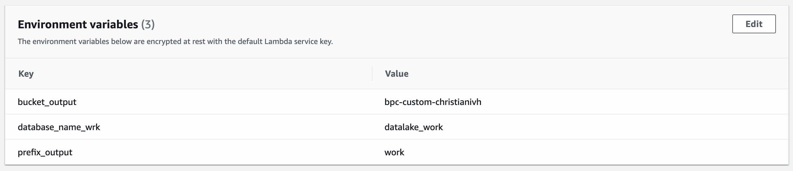

# datalake_bpc


## Lambda generador de trigger de envento del datalake


### Configurar variables de entorno de lambda

Estas variables de entorno se configuran en el lambda:

    
```

bucket_output = bpc-custom-christianivh

database_name_wrk = datalake_work

prefix_output = work
```
